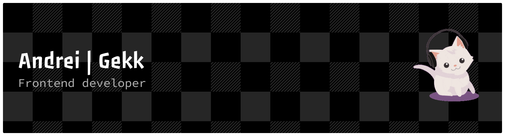

**Hey! 👋**

I'm Andrei, or you can also call me Gekk.

**A little side story of my in-game name**

- My name was inspired by the anime _A Certain Scientific Railgun_. The main character loves a mascot called **Gekkota**.
- At one point in the series, she jokingly calls a doctor "Gekkota". That doctor is actually one of the creators of the city they live in, but he prefers to stay out of the spotlight.
- I shortened **Gekkota** to **Gekk** to make it easier to say and a bit more unique.
- I like the idea behind that character as well, being part of something big while staying more like a background builder.

**My Experience so far...**

- I've been working as a frontend developer for over a year, building and maintaining several projects that helped me grow both technically and professionally.
- Throughout these projects, I’ve gained experience turning ideas into working applications and improving existing systems.
- In some cases, I’ve also been responsible for setting up projects from scratch, which taught me how important good structure and planning are when starting development.
- Each project has helped me improve my problem-solving skills and my approach to writing cleaner and more maintainable code.

**Tech Stack:**  
                         

**Fun Facts about me:**

- MMO games are what I really love since they let me see the progress of my daily grind. I also enjoy how MMOs let you interact with others, almost like a digital version of real life.
- I'm not really a fan of first-person games—not because I dislike them, but because they tend to give me headaches.
- I actually have a twin, so if you see me around... think twice.

**Daily Progression and Streak**

